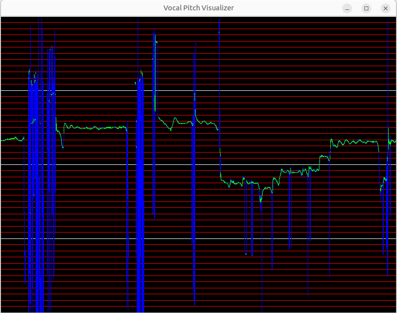

# Vocal Pitch Visualizer for Linux
Simple vocal pitch visualizer

## Install
Ubuntu package: https://github.com/nazodane/pitch_visualizer/releases

# Usage
```sh
pitch_visualizer
```
* F11 key: Fullscreen toggle
* ESC key: Close

## Build
```sh
sudo apt install libglew-dev libpipewire-0.3-dev libcap-dev libboost-all-dev
make
```

## Implementation Notes
* Written in C++ (not Python)
* Pitch range is from 55Hz (A1) to 880Hz (A6)
* non-FFT-based Autocorrelation (rough)
* Draw multiple lines at once
* Realtime

## Screenshot


